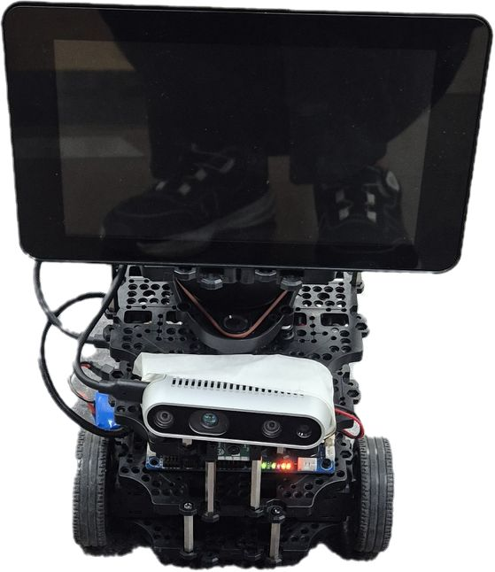
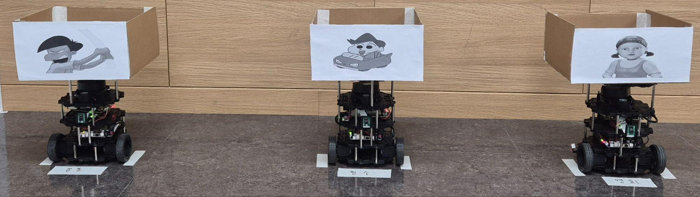
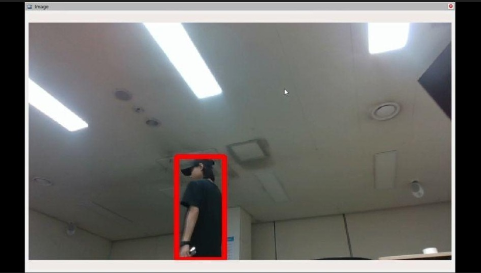
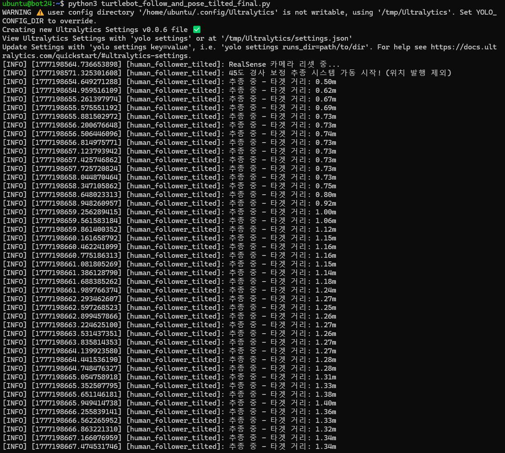
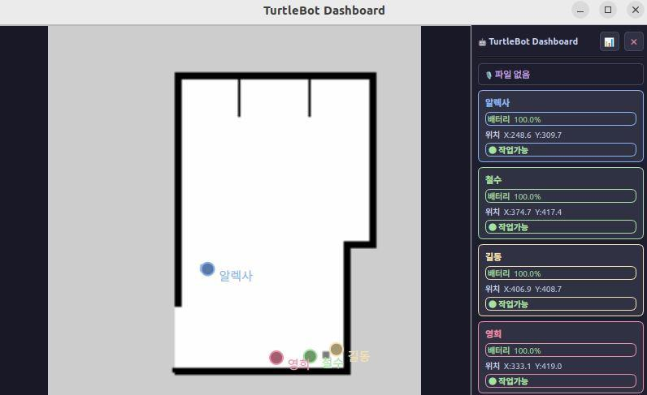
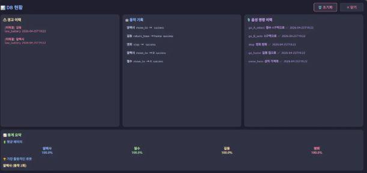
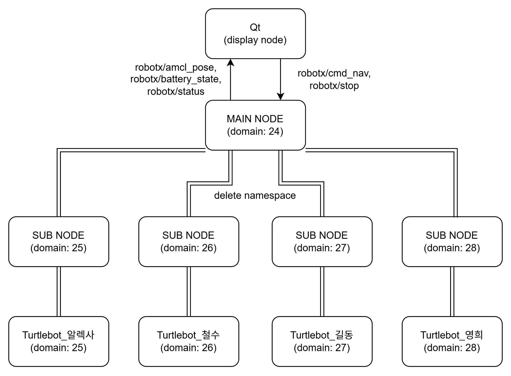
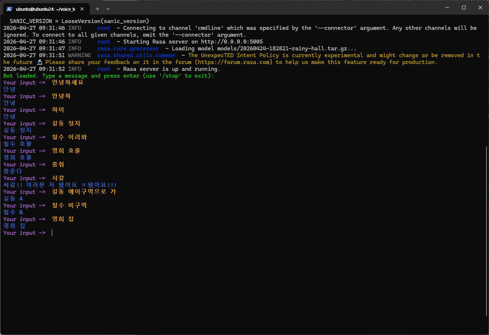

# 🤖 Vocal-Maestro Robot System (음성 명령 다중로봇 제어 시스템)

---

## 개발 배경
물류 창고의 규모가 대형화(1,000~5,000㎡ 42.9%, 10,000㎡ 이상 34.2%)됨에 따라 작업자의 이동 거리가 길어지고 있습니다.

  
  

* 작업자의 이동을 최소화하여 피로도 및 부상 위험을 감소시키고 생산성을 향상시키기 위해 본 시스템을 기획했습니다.
* 비정형 창고 및 공장 등 유연한 환경 대응이 가능하며 인프라 변경 없이 도입 즉시 사용할 수 있는 다중 로봇 시스템이 필요합니다.

---

## 📑 프로젝트 개요
**Vocal-Maestro Robot System**은 음성 명령을 통해 다수의 로봇(Swarm System)을 제어하고 작업자를 추종하며 실시간 상태를 모니터링하는 솔루션입니다.

* **Voice Recognition:** 음성 명령을 통한 로봇 호출, 정지, 지정 구역 이동 제어를 지원합니다.
* **Follow People:** 작업자 객체를 인식하고 원활하게 추종합니다.
* **Swarm System:** 다중 로봇 환경에서의 원활한 통신 및 그룹 제어를 수행합니다.
* **Status & Database Display:** 로봇 상태 및 데이터베이스 로그를 실시간 대시보드로 표출합니다.

## 🎬 시연 환경 (Demonstration Environment)

*(👆 썸네일을 클릭하시면 유튜브 시연 영상으로 이동합니다.)*

### 🤖 로봇 외관 및 역할

  
  

* **Master Robot (좌측):** 카메라와 디스플레이 패널이 장착되어 있으며, 작업자를 인식하고 추종하는 '메인 컨트롤 타워' 역할을 수행합니다.
* **Slave Robots (우측):** 마스터 로봇 및 대시보드의 명령을 받아 A/B/C 구역 이동, 피킹, 수거 등 실제 물리적 물류 작업을 수행하는 워커 로봇(철수, 길동, 영희)입니다.

---

## 💡 핵심 기술 및 구현 메커니즘

### 🎯 1. 객체 추종 (Object Following)
> 마스터 로봇이 비전 센서를 통해 작업자를 인식하고, 실시간으로 거리를 조절하며 물리적으로 따라다니는 시스템입니다.

  
  

* **비전 인식 및 좌표 추출 (YOLOv5nu):**
  * 마스터 로봇에 탑재된 Intel RealSense D435 카메라를 통해 실시간 RGB 이미지를 수신합니다.
  * 임베디드 환경에 최적화된 경량화 모델인 `YOLOv5nu`를 활용하여 영상 내의 '사람(Person)' 객체를 탐지합니다.
  * 탐지된 사람의 Bounding Box를 기준으로 중심점 좌표(x, y)를 실시간으로 계산하여 시각적 목표점을 설정합니다.
* **제어 알고리즘 (회전 및 직진):**
  * **회전 제어:** 추출된 객체의 중심점(x)이 이미지 해상도의 중앙에서 벗어난 픽셀 오차를 계산합니다. 이 오차값을 기반으로 P-제어(비례 제어)를 적용하여 로봇의 Z축 회전 각속도를 생성, 작업자가 항상 카메라 정중앙에 위치하도록 회전시킵니다.
  * **거리 제어:** 객체의 중심 좌표에 해당하는 픽셀의 깊이(Depth) 데이터를 추출합니다. 설정된 안전 유지 거리(예: 1.0m)와 현재 측정된 깊이 값의 차이를 오차로 두고 제어값을 산출하여, 멀어지면 전진 속도를 높이고 가까워지면 정지 혹은 후진하도록 구동합니다.

---

### 📊 2. 대시보드 (Dashboard)
> 다수의 로봇 상태를 직관적으로 모니터링하고 데이터를 영구적으로 기록하는 중앙 통제 및 관제 소프트웨어입니다.

  
  

* **GUI 및 실시간 매핑 (Qt5 프레임워크):**
  * C++ 기반의 Qt5를 사용하여 메인 관제 UI를 구축했습니다. `QGraphicsView` 기반 캔버스 위에 ROS2의 SLAM으로 생성된 실제 맵(.pgm 파일)을 베이스 레이어로 렌더링합니다.
  * 수신된 로봇의 X, Y 좌표 및 쿼터니언(Quaternion) 방향 데이터를 Qt의 픽셀 좌표계로 실시간 변환하여 4대의 로봇 아이콘을 맵 위에 매핑합니다.
* **상태 모니터링 및 DB 연동 (MariaDB):**
  * 각 로봇의 배터리 토픽과 현재 작업 상태를 파싱하여 UI 우측 패널에 프로그레스 바 형태로 표출합니다.
  * MariaDB를 연동하여 시스템에서 발생하는 이벤트를 체계적으로 기록합니다 (`robot_info`, `voice_command_log`, `picking_event`, `alert_log` 테이블 활용). 이를 통해 관리자가 추후 작업 통계를 조회할 수 있는 기반을 제공합니다.

---

### 🌐 3. 도메인 브릿지 (Domain Bridge)
> Swarm System 환경에서 로봇 간의 네트워크를 논리적으로 분리하고, 필요한 데이터만 선별적으로 교환하게 하는 ROS2 네트워크 인프라 기술입니다.

  

* **ROS_DOMAIN_ID 기반 망 분리:**
  * ROS2 DDS의 특성을 활용하여 메인 관제 PC는 **Domain 24**를 사용하고, 4대의 로봇은 각각 **Domain 25~28**로 독립된 네트워크 공간을 할당받습니다. 이를 통해 토픽 이름 충돌을 원천 차단합니다.
* **선택적 토픽 라우팅 (Traffic Control):**
  * `domain_bridge` 패키지를 활용해 중앙과 각 로봇 사이에 가상의 게이트웨이를 구축합니다.
  * YAML 설정을 통해 대시보드 렌더링에 필수적인 `battery_state`, `amcl_pose`, `status` 토픽만 양방향으로 브릿징(Whitelist 방식)합니다. 브릿징 시 로봇의 네임스페이스를 자동 맵핑하여 데이터 식별을 용이하게 합니다.

---

### 🗣️ 4. 음성인식 (Voice Recognition)
> 자연어 명령을 통해 특정 로봇을 지정하고 작업을 지시할 수 있는 오프라인 기반 지능형 인터페이스입니다.

  
  

* **호출어 인식 및 음성 수집 (OpenWakeWord & VAD):**
  * 백그라운드에서 동작하는 OpenWakeWord 엔진이 "Alexa" 호출어를 감지하여 시스템을 활성 상태(Wake-up)로 전환합니다.
  * VAD(Voice Activity Detection) 알고리즘을 통해 사용자의 발화가 끝나는 지점을 파악해 명령 구간의 오디오 파일만 수집합니다.
* **음성-텍스트 변환 및 NLU 의도 분석 (Whisper & Rasa):**
  * **Whisper STT:** 수집된 오디오는 로컬 환경에서 OpenAI의 경량 Whisper 모델을 통해 텍스트로 변환되어 보안성과 응답성을 확보합니다.
  * **Rasa NLU:** 변환된 비정형 텍스트는 Rasa 엔진으로 전달되어 문장의 의도(Intent)를 분류하고, 조작 대상이 되는 로봇의 이름(Entity) 및 목적지를 추출합니다.
* **명령 파싱 및 로봇 제어 연동:**
  * Rasa에서 분석된 결과는 JSON 형태의 `VoiceResult` 데이터로 Qt 메인 시스템에 전달됩니다.
  * 대시보드는 이를 바탕으로 대상 로봇의 Domain ID를 식별하고, 목표 좌표를 전송해 자율주행을 트리거하며, Typecast TTS를 통해 사용자에게 음성 피드백을 제공합니다.

---

## 5. 트러블 슈팅
* **Q. Qt 맵 상 위치 오차:** * **A.** ROS2 좌표계와 Qt 맵 픽셀 좌표계 사이의 스케일 및 오프셋 값 불일치로 오차가 발생했습니다. 로봇을 특정 위치에 고정시킨 뒤 수치를 반복 비교하여 오차를 줄인 근사 값으로 변환 처리했습니다.
* **Q. 지도상 작업자 위치 튐 현상:** * **A.** 마스터 로봇 회전 시 상대좌표계를 사용하여 객체 좌표가 함께 흔들리는 문제가 발생했습니다. 카메라 Depth 값을 절대 좌표계 기반으로 변환하는 로직으로 개선 방향을 도출했습니다.
* **Q. 임베디드 기기 병목 현상:** * **A.** 고해상도 이미지와 깊이 데이터 동시 처리로 라즈베리 파이의 CPU/네트워크 대역폭이 초과되었습니다. 전체 데이터를 구독하지 않고 객체 중심 좌표의 Depth 정보만 선택 추출하여 연산량을 대폭 낮췄습니다.
* **Q. 온디바이스 TTS 지연 및 인식률 저하:** * **A.** 임베디드 환경의 추론 지연과 Whisper Tiny 모델의 고유 명사 인식률 저하가 발생했습니다. 정적인 답변은 사전 생성된 오디오 파일(WAV/MP3) 재생으로 대체하여 지연을 제거했습니다.

---

## 6. 보완점 및 향후 과제
* **좌표계 변환 정밀도 향상:** 마스터 로봇 방향 변화에 따른 작업자 위치 표시 오류를 완전히 해결하기 위해, 카메라 데이터를 절대 좌표계 기반으로 정교하게 변환하는 로직의 구현이 필요합니다.
* **오프로딩(Offloading) 구조 도입:** 음성 처리 연산 부하를 임베디드 기기에서 분산시키기 위해, 음성 데이터를 외부 고성능 PC로 전송하여 처리하는 아키텍처 도입을 고려하고 있습니다.
* **하드웨어 보강:** 작은 모델(Whisper Tiny) 특성상 발생하는 '터틀봇' 등 고유 명사 인식률 저하 문제를 극복하기 위해, 음성 인식 전용 보드의 추가 장착을 검토 중입니다.
* **안정화 및 심화 테스트:** 제한된 프로젝트 기간으로 인해 부족했던 실환경 기반의 테스트를 추가로 수행하여, 세세한 엣지 케이스와 버그를 수정해 나갈 예정입니다.